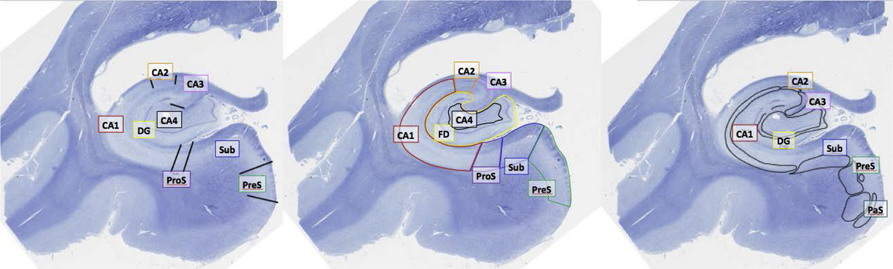

# Introduction

## What data is used for this project?

In the following, a data-set from {cite:t}`wanjia_abrupt_2021` that is available on [OpenNeuro](https://openneuro.org/datasets/ds003707/versions/1.0.0) will be used. The goal is to assess if a machine learning algorithm trained on the `old` vs `new` images is able to predict if an object was seen before based on the brain activation. 
Thus, the question is, with what precision will the algorithm be able to predict if a picture has been seen or not. 

```{note}
In the upcoming section on [data exploration](../code/data_exploration.ipynb), the data will be explored and the task will be explained. 
Here, the idea behind the research question is outlined. 
```

**What was the goal of the original study?** 
```{toggle}
The primary goal of the authors of the original study was to answer a very different question than the one pursued here. 
Wanjia et al. were interested in how  brain activity changes in relation to highly similar images. They wanted to show, in what way a decorrrelation of hippocampal activation may relate to a subsequent resolution of memory interference. In their study, the authors were able to show that activity in the regions of the dentate gyrus and one subregion of the hippocampus (CA3) shows a decorrelation pattern that is associated with learning. While memories traces that interfere will overlap during the initial encoding, over time the authors found there to be a pattern that leads to these memory traces being less similar, therefore aiding memory performance. 

In the present study, the design of the study described above will be used to pursue a very different question: 
How well can machine-learning be used to classify brain activation for the classic old-new recognition paradigm.
```

## The old-vs-new paradigm

Let's see what ChatGPT has to say on the classic old-new paradigm:
<blockquote>
<p> 

Several studies have examined the neural correlates of old-new recognition using fMRI. For example, some studies have found that successful old-new recognition is associated with increased activity in the medial temporal lobe (MTL), including the hippocampus and parahippocampal gyrus, which are known to be important for long-term memory formation and retrieval (e.g., {cite:p}`davachi_multiple_2003, eldridge_remembering_2000`). 

Other studies have focused on the role of the prefrontal cortex (PFC) in old-new recognition. The PFC is thought to play a critical role in monitoring and manipulating information in working memory, which may also be important for successful old-new recognition. For example, some studies have found that successful old-new recognition is associated with increased activity in the dorsolateral prefrontal cortex (DLPFC), which is thought to be involved in working memory processes (e.g., {cite:p}`ranganath_functional_2005, simons_distinct_2005`).


Overall, the literature suggests that successful old-new recognition is associated with activity in both the MTL and PFC, which may reflect the complementary roles of these regions in long-term memory formation and retrieval. 

(ChatGPT, personal communication, 2022, March 5th).</p>
</blockquote>

In the following, I will outline what this paradigm is about and what we can expect, diving into the literature that ChatGPT recommended. 

## What can we expect from the previous literature?
**Which areas play a role for recognition memory?**

Differentiating what we have previously seen from what we have never encountered is a skill we rely on in various areas of our every day life. This ability is inherent to our memory, as a part of which we are able to *encode*, *store* and *retrieve* information {cite:p}`melton_implications_1963`. Even though this ability is remarkable, it has only been in the recent years that humankind has begun to unravel how our memory function and how it is implemented on the neuronal level {cite:p}`tulving_episodic_2002`. 

Different areas of the brain are known to be important for the ability to recognize what was previously seen, i.e. `recognition memory`. Although the goal of the present project is not to relate areas of the medial temporal lobe (MTL) to recognition memory,the current literature is briefly summarized below. 

**Areas within the MTL and their importance for recognition memory**
```{toggle}
Different areas of the MTL receive different inputs and are thought to be involved in different computations. In this section, it will briefly be outlined how different areas of the MTL may have varying importance for recognition memory. 

The perirhinal corte, which is known to play a role in object recognition {cite:p}`davachi_multiple_2003`, as well as object identification {cite:p}`murray_parahippocampal_2000`, has in the past been associated with the ventral visual stream {cite:p}`suzuki_neuroanatomy_1996`. The parahippocampal cortex on the other hand, is known to mainly receive input from areas within the dorsal visual stream. In this sense, for monkeys it has been shown that the parahippocampal cortex receives input from the dorsolateral prefrontal cortex {cite:p}`goldman-rakic_dual_1984` and the retrosplenial cortex {cite:p}`suzuki_neuroanatomy_1996`, which is involved in spatial cognition {cite:p}`mitchell_retrosplenial_2018`. Both of these areas are a major source of input to the entorhinal cortex, which in turn provides input to the hippocampus - at least in macaque monkeys {cite:p}`witter_entorhinal_1991` . 

Thus, anatomically different regions of the MTL receive different inputs. Furthermore, they may also differ in their functionality, as lesion data suggests. Lesions to both the perihinal cortex and the parahippocampal gyrus lead to impairments in object recognition to a greater degree compared to monkeys that had a lesion in the hippocampus, amygdala and the adjacent cortices {cite:p}`zola-morgan_lesions_1989`. Ablatations of the perirhinal cortex in rhesus monkeys resulted in greater object recognition difficulties than ablatations of the entorhinal cortex {cite:p}`meunier_effects_1993, meunier_effects_1993`. In another study, the ablatation of the rhinal cortex has been shown to have similar implications for recogntion memory as a ablatation of the hippocampus {cite:p}`murray_visual_1986`. However, lesions to other of the above mentioned areas compared to lesion to the parahinal cortex alone have been associated with reduced recognition memory performance, but with the magnitude of such performance reduction being greatly decreased compared to perirhinal lesions alone {cite:p}`alvarez_damage_1995`. Although the studies above were performed using monkeys, it became apparent that one substructure - the perirhinal cortex may in particular be associated with recognition memory. 

How this translates to humans is difficult to estimate, as lesion studies with humans are rare {cite:p}`davachi_multiple_2003`. It has been founnd that damage limited to the hippocampus can be associated in particular with impairments toward recollection, not recognition {cite:p}`holdstock_under_2002, mayes_relative_2002`. Within tasks that require recollection of details, recognition memory may however be impaired as a result of hippocampal insults {cite:p}`holdstock_under_2002`.  However, studies exist that link selective hippocampal damage and impairments for recongition memory (mann recongition) or that do not find a relatively greater impairment for recollection and familarity {cite:p}`stark_recognition_2002`. 

Although the literature is not clear as to wheather a clear division can be made between an association of the perirhinal cortex and recognition, as well as the hippocampus and recollection, such a division has been proposed by {cite:p}`brown_recognition_2001`. They state the main role of the perirhinal cortex to may be the processing of novel information, which is thought to occur in a rapid manner. Meanwhile, within the hippocampus they state there to be a recollection system. This has been supported by encoding activation within the hippocampus predicting recollection and encoding activatioin in the perirhinal cortex predicting later recognition, but not the other way around {cite:p}`davachi_multiple_2003`. {cite:t}

It should be noted, that furthermore different subregions of the hippocampus may play differerent roles for memory as a whole. {cite:t}`eldridge_dissociation_2005` found encoding and retrieval processes to be associated with different sub regions of the hippocampus. The dentate gyrus and the second and third field of the  cornu ammonis (CA) being associated with memory formation, while areas later in the hippocampal circuit (such as the subiculum) are associated with memory retrieval. Similarily {cite:t}`eldridge_remembering_2000` showed that hippocampal activity is only predictice of recollection but not recognition in an earlier study (which was mentioned by Chat-GPT). However, this will not be covered in detail. The different subfields of the hippocampus are shown in [`Fig. 1`](Fig_1). 


:::{figure-md} Fig_1 \


This figure was published by {cite:t}`olsen_progress_2019`. Different hippocampal subfield segmentations performed by three neuroanatomists using the same data are displayed.  bbreviations: dentate gyrus/fascia dentata (DG/FD); prosubiculum (ProS); presubiculum (PreS); parasubiculum (PaS/ParaS); subiculum (Sub).
:::
```
One can summarize the lizerature in the following way: The MTL is involved in recognition memory. Different subregions play different roles for recognition memory {cite:p}`davachi_multiple_2003`. 

While it was previously outlined that areas within the MTL are known to be particularily associated with recognition memory, Chat-GPT mentioned areas outside of the MTL to play a role for recognition memory. 
One study by {cite:t}`simons_distinct_2005` suggested by Chat-GPT however did not look into recognition memory and instead associated activity within different areas of the prefrontal cortex with successful recollection. Chat-GPT did however point towards there being relatively little research on how the hippocampal formation and the cortex interact as part of episodic memory formation {cite:p}`ranganath_functional_2005`. This furthermore raises the question - if the previously outlined literature does not fall short in regards to the complex activation patterns displayed during successul retrieval. {cite:t}`ranganath_functional_2005` showed a distributed network of activity to aid successful memory retrieval. 

**What role does the cortex play for (recognition) memory?**
```{toggle} recog_memory_cortex
Firstly, it was outlined that the ventral stream of the visual pathways is one of the major sources of input for the perirhinal cortex. It has also been outlined that the perirhinal cortex in particular can be associated with recognition memory. In this sense, areas of the inferior temporal cortex can be linked to object identify and this area is known to be a part of a network that enables object recognition {cite:p}`kar_evidence_2019`. It has been shown that pharmacologically inactivation of one node within the network (the ventrolateral prefrontal cortex) is associated with decreased performance for certain types of object recognition {cite:p}`kar_fast_2021`. The ventromedial prefrontal cortex has also been associated to play an important role in recognition memory {cite:p}`akirav_ventromedial_2006`. Note however, that these findings come from studies with macaque monkeys. Furthermore it has been shown in rodents that the medial prefrontal cortex can be linked to associative recognition memory via projects into the lateral entorhinal cortex {cite:p}`chao_medial_2016`.

Outlining the general activation patterns between limbic areas and the cortex and their role for memory functioning would exceed the goal of this section. The neural circutry that enables memory formation is far more complex {cite:p}`frey_orbitofrontal_2002`. Several aspects have not been covered, for example what role the insular cortex plays for object recognition memory {cite:p}`bermudez-rattoni_forgotten_2014`.
```


Although the above description barely scratches the surface of how the brain enables us to recognize what was previously seen, it did become apparent what areas activity should be expected in. This will serve as the basis for what is expected within the exploratory analyses and the linear model. Thus, in the following, it shall be explored if the recognition of objects depends soley on activation within the MTL. 

Following this, it will be explored if a supervised model can be trained to predict if an item was previously seen! 


Also, here is a TED-talk on an aspect of memory I did not cover at all I found interesting!

<iframe width="560" height="315" src="https://www.youtube.com/embed/Q4tbqEAMMLw" title="YouTube video player" frameborder="0" allow="accelerometer; autoplay; clipboard-write; encrypted-media; gyroscope; picture-in-picture" allowfullscreen></iframe>

```{toggle}
Totally not because as a psychologist I don't know anything about molecules.
<center></center>
<center><sub><sup><sub><sup><sup>https://media.giphy.com/media/v1.Y2lkPTc5MGI3NjExNDI0ZDk3Y2MyZWZhMjhhMzlkMTdmNzhlMDFkNmY0MjYxOWRhNTRkNyZjdD1n/3o6MbgktNOTZWhNlni/giphy.gif </sup></sup></sub></sup></sub></center>
```